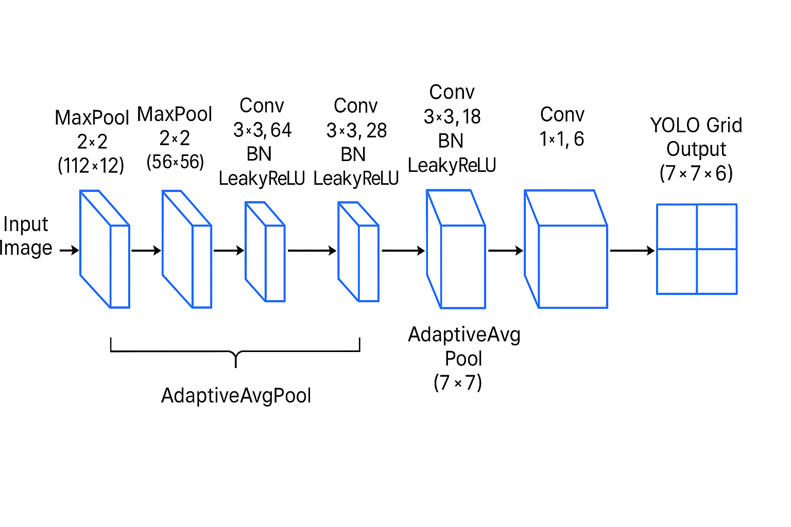
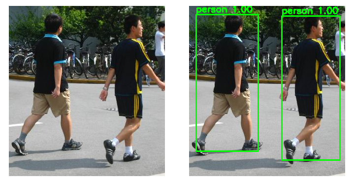

# TinyYOLOv1 From Scratch

A complete educational implementation of YOLOv1-style object detection built from scratch using PyTorch. This project is designed for **learning** how deep learning models are built, trained, and deployed in real-world applications.

## 🎓 Project Purpose

This repository serves as a comprehensive learning resource covering the entire machine learning pipeline:

- **Model Architecture**: Understanding how YOLO-style object detectors work
- **Training Pipeline**: From data preprocessing to model optimization
- **Deployment**: Inference on images, videos, and web applications
- **Edge Deployment**: Converting models for Jetson Xavier using TensorRT

Perfect for students and developers who want to understand object detection from the ground up, without relying on pre-built frameworks.

## 🏗️ Model Architecture

The TinyYOLOv1 model uses a lightweight CNN backbone followed by a detection head that predicts bounding boxes and class probabilities on a 7×7 grid:



**Key Components:**
- **Backbone**: 5-layer CNN with batch normalization and LeakyReLU activations
- **Detection Head**: Convolutional layers producing `(S, S, 5+C)` output
- **Grid System**: 7×7 grid where each cell predicts one bounding box
- **Output Format**: `[tx, ty, tw, th, obj_score, class_prob]` per cell

## 📋 Prerequisites

- Python 3.8+
- PyTorch (see installation below)
- CUDA-capable GPU (recommended for training, optional for inference)

## 🚀 Quick Start

### 1. Clone the Repository

```bash
git clone https://github.com/Sim43/TinyYOLOv1-From-Scratch.git
cd TinyYOLOv1-From-Scratch
```

### 2. Install Dependencies

```bash
pip install -r requirements.txt
```

### 3. Download Dataset

The project uses the **PennFudanPed** dataset for pedestrian detection:

```bash
bash data/download_pennfudan.sh
```

**Important**: Ensure the dataset is extracted to `data/PennFudanPed/` with the following structure:
```
data/PennFudanPed/
├── PNGImages/     # Original images
├── PedMasks/      # Segmentation masks
└── Annotation/    # XML annotations (optional)
```

### 4. Train the Model

Start training with default configuration:

```bash
python -m src.train
```

The training script will:
- Load and preprocess the dataset
- Train the TinyYOLOv1 model for 30 epochs
- Save the best checkpoint to `runs/yolov1_tiny_pennfudan.pt`

You can modify training parameters in `src/config.py` (epochs, batch size, learning rate, etc.).

### 5. Run Inference

Once training is complete, you can use the model for inference in several ways:

#### Option A: Streamlit Web App (Recommended)

Launch the interactive web interface:

```bash
streamlit run app.py
```

Features:
- Upload images or videos
- Adjust confidence and IoU thresholds
- Real-time visualization
- Support for both `.pt` and `.engine` models

#### Option B: Command-Line Image Inference

```bash
python -m src.infer_image --image path/to/image.jpg --conf 0.35 --iou 0.5
```

#### Option C: Command-Line Video Inference

```bash
# Process video file
python -m src.infer_video --source video.mp4 --conf 0.35 --iou 0.5

# Use webcam (pass 0 for default camera)
python -m src.infer_video --source 0 --conf 0.35 --iou 0.5
```

**Arguments:**
- `--conf`: Confidence threshold (0.0-1.0), default: 0.35
- `--iou`: IoU threshold for NMS (0.0-1.0), default: 0.5
- `--ckpt`: Path to checkpoint (default: `runs/yolov1_tiny_pennfudan.pt`)

## 🎬 Results

Here's a demonstration of the model detecting pedestrians in a video:

<div align="center">
  
</div>

<div align="center">
  
</div>

The model successfully detects pedestrians with bounding boxes and confidence scores, running in real-time on both CPU and GPU.

## 📁 Project Structure

```
.
├── src/                    # Source code modules
│   ├── config.py          # Configuration and hyperparameters
│   ├── dataset.py         # Dataset loading and preprocessing
│   ├── model.py           # TinyYOLOv1 architecture
│   ├── loss.py            # YOLOv1 loss function
│   ├── train.py           # Training script
│   ├── utils.py           # Utility functions (target building, NMS)
│   ├── infer_image.py     # Image inference script
│   ├── infer_video.py     # Video inference script
│   └── README.md          # Detailed code documentation
├── data/                   # Dataset directory
│   ├── download_pennfudan.sh  # Dataset download script
│   └── torch.sh            # Jetson PyTorch installation
├── runs/                   # Model checkpoints and engines
├── app.py                  # Streamlit web application
├── torch_to_trt_engine.py  # TensorRT conversion script
└── requirements.txt        # Python dependencies
```

For detailed explanations of each module, see [`src/README.md`](src/README.md).

## 🎯 Usage Examples

### Training Custom Configuration

Edit `src/config.py` to customize:
- Grid size (S)
- Number of classes (C)
- Image size
- Training epochs and batch size
- Learning rate and optimizer settings

### Adjusting Inference Parameters

Lower confidence threshold detects more objects but may include false positives:
```bash
python -m src.infer_image --image test.jpg --conf 0.25
```

Higher IoU threshold keeps more overlapping boxes:
```bash
python -m src.infer_image --image test.jpg --iou 0.7
```

## 🚀 Jetson Xavier Deployment

For deployment on NVIDIA Jetson Xavier devices, follow these steps:

### 1. Install PyTorch for Jetson

Jetson requires ARM64-compatible PyTorch builds. Use the provided script:

```bash
bash data/torch.sh
```

This installs pre-built PyTorch and torchvision wheels compatible with Jetson's architecture.

### 2. Install OpenCV for Jetson

Install OpenCV separately using Jetson-specific packages (refer to NVIDIA's documentation for the latest installation method).

### 3. Convert Model to TensorRT Engine

Convert your trained `.pt` model to a TensorRT `.engine` file for optimized inference:

```bash
python3 torch_to_trt_engine.py \
    --input runs/yolov1_tiny_pennfudan.pt \
    --output runs/yolov1_tiny_pennfudan.engine
```

**Arguments:**
- `--input`: Path to input `.pt` or `.pth` checkpoint
- `--output`: Path to output `.engine` file
- `--fp16`: Enable FP16 precision (default: True, recommended for Jetson)
- `--workspace`: TensorRT workspace size in MB (default: 2048)

The conversion process:
1. Exports PyTorch model to ONNX format
2. Builds TensorRT engine using `trtexec`
3. Saves optimized `.engine` file

**Note**: Ensure TensorRT is installed on your Jetson device. The script uses `/usr/src/tensorrt/bin/trtexec` by default.

### 4. Use Engine in Streamlit App

The Streamlit app (`app.py`) automatically detects and supports `.engine` files. Simply place your `.engine` file in the `runs/` directory and select it from the model dropdown.

## 🤝 Contributing

This is an educational project. Feel free to:
- Experiment with different architectures
- Try different datasets
- Optimize the training pipeline
- Add new features

## 📄 License

See [LICENSE](LICENSE) file for details.

---

**Happy Learning!** 🎉

